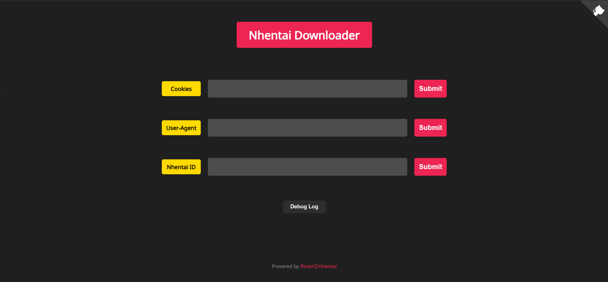

# nhentai-downloader-web

Generated by Chatgpt

A simple and responsive Flask-based Web UI for the [nhentai CLI](https://github.com/RicterZ/nhentai).  
Easily download manga from nhentai.net using gallery ID, with cookie and user-agent support.



---

## ✨ Features

- 🔒 Password protection (set via environment variable)
- 🔽 Download by nhentai gallery ID
- 🍪 Cookie and User-Agent configuration
- 🧾 Real-time download logs (debug log viewer)
- 📦 Dockerized for easy deployment

---

### 🔌 Get to run

# Method 1: Git clone
```bash
git clone https://github.com/YourUsername/nhentai-downloader-web.git
cd nhentai-downloader-web
python -m venv .venv
source .venv/bin/activate  # or .venv\Scripts\activate on Windows
pip install -r requirements.txt
python nhentai.py
```
Visit http://localhost:61234
---

## Method 2: Dockerhub
```bash


